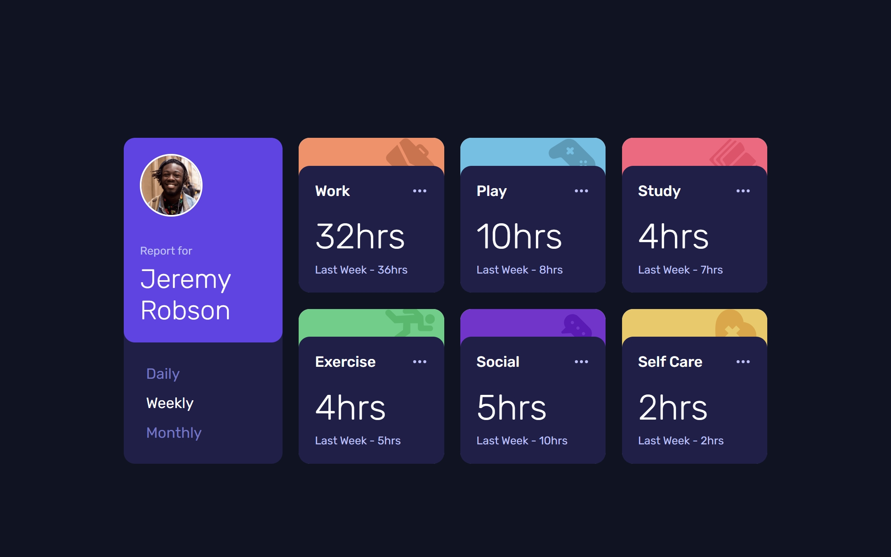

# Time Tracking Dashboard

This is a solution to the [Time tracking dashboard challenge on Frontend Mentor](https://www.frontendmentor.io/challenges/time-tracking-dashboard-component-PEQNxT2QQ). Frontend Mentor challenges help you improve your coding skills by building realistic projects.

**Live Site URL:** [https://ganeshreddychimmula.github.io/time-tracking-dashboard/](https://ganeshreddychimmula.github.io/time-tracking-dashboard/)

## Table of Contents

- [Overview](#overview)
  - [The Challenge](#the-challenge)
  - [Screenshot](#screenshot)
- [My Process](#my-process)
  - [Built With](#built-with)
  - [What I Learned](#what-i-learned)
  - [Continued Development](#continued-development)
  - [Useful Resources](#useful-resources)
- [Notes](#notes)
- [Author](#author)
- [Acknowledgments](#acknowledgments)

## Overview

### The Challenge

The challenge was to build out this time tracking dashboard component and get it looking as close to the design as possible. Users should be able to switch between viewing daily, weekly, and monthly stats.

### Screenshot



## My Process

### Built With

- Semantic HTML5 markup
- CSS custom properties
- Flexbox & CSS Grid
- **CUBE CSS** methodology for a scalable and maintainable architecture.
- **Every Layout** principles for building robust, intrinsic layouts.
- Mobile-first workflow
- Vanilla JavaScript for data handling and state management.
- Mobile-first workflow

### What I Learned
This project was a deep dive into creating a resilient and logical front-end architecture. The main focus was the practical application of **CUBE CSS** combined with the layout primitives from **"Every Layout"**.

The goal was to move beyond simply recreating a design and instead build a system that is flexible and adapts to its content and context, not just a set of device breakpoints.

- **Intrinsic Layout Primitives**: I focused on identifying and implementing several "Every Layout" primitives to create a more robust structure that governs itself.
    - **The Sidebar Layout**: Used for the main page structure. I learned to create a container-based breakpoint where the layout shifts from horizontal to vertical based on available space, not a rigid media query. This makes the component highly reusable.
    - **The Stack Primitive**: Implemented using the `* + *` selector to manage vertical spacing between elements within each card, ensuring consistent rhythm and flow without redundant margin classes.
    - **The Switcher**: Used for the main content and hours section in each card, allowing elements to switch from a horizontal arrangement to a vertical one when compressed, preventing overflow and maintaining readability.
- **Fluid Design with Custom Properties**: I leaned heavily on CSS custom properties not just for colors, but for creating a fluid type and space scale using `clamp()`. This ensures the entire interface scales smoothly and proportionally with the viewport, embodying the "be the browser's mentor, not its micromanager" philosophy.
- **Clean State Management**: I reinforced the practice of using JavaScript solely for state management (fetching data and updating `data-state` attributes) and letting CSS handle all visual representation based on those states. This creates a clean, maintainable separation of concerns.

This project was a great opportunity to practice and explore the **CUBE CSS methodology**. I focused on breaking down the interface into:

- **Composition (C):** Defining the overall layout and structure of the dashboard.
- **Utility (U):** Creating reusable utility classes for common styling needs (e.g., font weights, colors, spacing - though this can be an area for further refinement).
- **Block (B):** Identifying distinct components like the profile card and the individual time tracking cards.
- **Exception (E):** Handling variations, such as the different colors and icons for each activity card.


### Continued Development

In future development, I would like to focus on:
- **Refine the Grid Primitive**: While the current dashboard uses a simple grid, I want to explore the `minmax()` and `auto-fit` techniques from "Every Layout" to create an even more powerful and automated grid system for the activity cards.
- **Enhance Accessibility**: Conduct a more thorough accessibility audit, particularly around focus management for the interactive elements and ensuring all components are properly announced by screen readers.
- **Explore Container Queries**: As container queries gain more browser support, I'd like to refactor the layout primitives to use `@container` instead of the Flexbox-based "hacks," which would simplify the CSS even further.

### Useful Resources

During this project, the principles and ideas from the following resources were particularly helpful in shaping my approach to CSS and responsive design:

- [**CUBE CSS**](https://cube.css.com)**:** The core methodology I aimed to explore for structuring the CSS. Its principles of Composition, Utility, Block, and Exception were a key focus.
- [**Frontend Mentor**](https://www.frontendmentor.io)**:** The platform that provided the challenge and design.
- [**CSS-Tricks**](https://css-tricks.com)**:** A constant source of excellent articles and tips for all things CSS and web development.
- **"Be the browser’s mentor, not its micromanager" (Concept):** This idea (often discussed by Andy Bell, related to CUBE CSS) about building flexible, resilient layouts was a guiding principle.
- [**Utopia - Fluid Space Calculator**](https://utopia.fyi/space/calculator)**:** While perhaps not fully implemented in this version, resources like Utopia are invaluable for understanding and generating fluid typographic and spacing scales, which is a target for continued development.
- [**Custom variable guide**](https://css-tricks.com/a-complete-guide-to-custom-properties/)**:** They help DRY up your CSS. That is “Don’t Repeat Yourself.” Custom properties can make code easier to maintain because you can update one value and have it reflected in multiple places. Careful though, overdoing abstraction can make have the opposite effect and make code less understandable.They are particularly helpful for things like creating color themes on a website.
They unlock interesting possibilities in CSS. In no small part because they cascade.
The fact that they can be updated in JavaScript opens up even more interesting possibilities.
- [**Modular Scale**](https://www.modularscale.com/)**:** A modular scale is a mathematical rule that one can use to create intentional and harmonious typography sizing. A scale is represented as a number that gets multiplied against a base size again and again, creating 'steps'.
- [**CSS LOCKS - Precise control over responsive typography**](https://www.madebymike.com.au/writing/precise-control-responsive-typography/)**:** Creating fluid responsive typography with calc and viewport units. 
- [**EVERY LAYOUT**](https://every-layout.dev/)**:** Learn to write better, resilient CSS

## Notes
- A balanced CSS architecture was key: a foundation of fluid custom properties, preset classes for semantic components, and utility classes for granular overrides.

-  The dimensions of our elements should be largely derived from their inner content and outer context. When we try to prescribe dimensions, things tend to go amiss. All we should be doing as visual designers is making suggestions as to how the layout should take shape. We might, for instance, apply a min-height  or proffer a flex-basis.

- The CSS of suggestion is at the heart of algorithmic layout design. Instead of telling browsers what to do, we allow browsers to make their own calculations, and draw their own conclusions, to best suit the user, their screen, and device. Nobody should experience obscured content under any circumstances.

- ### CSS Architecture: A Balanced Approach
  A balanced approach was the most effective:

  1.  **Foundation with CSS Custom Properties and Fluid Sizing:** I prioritized defining all core design values (typography scales, spacing scales, colors) as CSS custom properties. Where appropriate, these values use fluid functions like `clamp()` to ensure type and space scales automatically adapt across different viewports. This forms the backbone of the application's fluidity.

  2.  **Preset Classes for Semantic Components and Variants:** For recurring UI elements that always combine a set of properties (like headings or specific dashboard card styles), I created preset classes (e.g., `.card-header`) that encapsulate these combinations. This keeps the HTML semantic and manageable, ensuring the optimal layout is viewed depending on the device's screen size.

  3.  **Utility Classes for Granular Adjustments and Overrides:** I employed utility classes (like `.u-text-sm`, `.u-fw-light`) for single-property adjustments or specific, composable overrides that didn't warrant a full preset. These are useful for making small changes to an otherwise standard element.

  By combining these approaches, I leveraged the strengths of each: the **semantic clarity and consistency of preset classes** for the main UI components, and the **composability and flexibility of utility classes** for fine-tuning and specific needs. Crucially, by basing both on **fluid CSS custom properties**, the entire application inherently adapts to varying screen sizes and conditions, embodying the "mentor, not micromanager" philosophy for a truly fluid dashboard.

- ### Composition

  -  Without primitive data types, you would have to be constantly teaching your programming language how to do basic operations. You would quickly lose sight of the specific, meaningful task you set out to accomplish with the language in the first place. A design system that does not leverage primitives is similarly problematic. If every component in your pattern library follows its own rules for layout, inefficiencies and inconsistencies will abound.
  - The primitives each have a simple responsibility: "space elements vertically", "pad elements evenly", "separate elements horizontally", etc. They are designed to be used in composition, as parents, children, or siblings of one another.

- There are more users who adjust their default font size in browser settings than there are users of the browsers Edge or Internet Explorer. That is: **disregarding users who adjust their default font size is as impactful as disregarding whole browsers**.
  - The units em, rem, ch, and ex present no such problem because they are all units relative to the user’s default font size, as set in their operating system and/or browser. Browsers translate values using these units into pixels, of course, but in such a way that’s sensitive to context and configuration. Relative units are arbitrators.

- As a rule of thumb, em units are better for sizing inline elements, and rem units are better for block elements. SVG icons are perfect candidates for em-based sizing, since they either accompany or supplant text.

- **Utility classes are for final adjustments, and should not be overridden by anything that comes before them.**

- Our scale variables are placed on the :root element, making them globally available. And by global, we mean truly global. Custom properties are available to JavaScript and also “pierce” Shadow DOM boundaries to affect the CSS of a shadowRoot stylesheet.

  JavaScript consumes CSS custom properties like JSON properties. You can think of global custom properties as configurations shared by CSS and JavaScript. Here’s how you would get the --s3 point on the scale using JavaScript (document.documentElement represents the :root, or <html> element):
  ```Js
  const rootStyles = getComputedStyle(document.documentElement);
  const scale3 = rootStyles.getPropertyValue('--s3');
  ```  

- The **vertical spacing** of your design should be based on your **standard line-height** because text dominates most pages’ layout, making one line of text a natural denominator.

- ### How to approach layout: Responsive Web Design: Content, Context, and Algorithms
  **content should largely dictate the size of components and layouts, but in a way that is profoundly influenced and adapted by the available space, screen size, and user settings through algorithmic and intrinsically responsive design principles**.

  Here's a breakdown of this approach:

  *   **Embrace the Web's Dynamic Nature**
      The web is not static or predictable like print media. Text runs dynamically wrap based on various factors, including device size and orientation, text size, and zoom level. Attempting to enforce direct or fixed control over how users consume content, such as setting fixed widths, is considered "foolhardy" and "anathema to responsive design". This can lead to undesirable user experiences like horizontal scrolling and broken zoom functionality.

  *   **Be the Browser's Mentor, Not its Micromanager**
      Instead of rigidly prescribing dimensions, designers should "relinquish control to the algorithms" that browsers use to lay out web pages automatically. The philosophy is to "be the browser's mentor, not its micro-manager," by providing solid rules and hints and then allowing the browser to make optimal decisions based on the user's specific context, device, and capabilities.

  *   **Content-Driven Sizing (Intrinsic Sizing)**
      By default, an element's size and shape are determined by its content: inline elements grow horizontally, and block elements grow vertically. The "area of a box is determined by the area of the content it contains". Since web content is dynamic and can change, static representations of layouts are misleading, and trying to "prescribe" fixed dimensions often leads to issues. The recommended approach is to make "suggestions" for layout, allowing browsers to calculate the most suitable arrangement for the user's environment. This philosophy is aligned with "Intrinsic Web Design," which emphasizes algorithmic, self-governing layouts.

  *   **Designing Without Seeing**
      Given the vast array of potential user setups, it's impossible to anticipate all visual combinations that might result. Therefore, designers should think of themselves as "writing programs for generating visual artefacts" rather than creating static visuals. Axioms, or foundational rules, define characteristics rather than direct visual outcomes, allowing the browser to accommodate the user best.

      - Adhering to axioms requires a mental shift: instead of directly creating visual artifacts, you are defining characteristics of artifacts that might emerge.
      - This means the exact visual outcome may not always be foreseen, but it is sound and desirable because the CSS is doing exactly what you intended: maintaining a reasonable measure regardless of context.
      - Ultimately, designing for the web is about "writing programs for generating visual artefacts," where axioms are the rules that influence how the browser creates those artifacts to best suit the user's setup

  *   **Axiomatic Design for System-Wide Consistency**
      Designs should be founded on simple, irreducible "axioms" that "pervade the design without qualifications or exceptions". A key example is the typographic measure axiom, such as *"the measure should never exceed 60ch"*. This axiom is applied system-wide through universal styles, layout primitives, and utility classes. The use of `ch` units for measure is crucial because it's based on character width, adapting reliably when the `font-size` changes, ensuring readability across different user settings.

  *   **Flexible Units and Algorithmic Layout**
      *   **Relative Units (em, rem, ch, ex)**: These units are "arbitrators" that translate values into pixels in a way sensitive to context and configuration, respecting user's default font sizes and ensuring accessibility. Using `rem` units, for instance, allows the entire interface to scale proportionately when the root `font-size` is adjusted.
      *   **Viewport Units (vw, vh, vmin, vmax)**: These units are relative to the browser viewport's size and can be combined with `calc()` to create algorithms that scale dimensions proportionately from a minimum value.
      *   **CSS Functions (`calc()`, `minmax()`, `min()`)**: These enable dynamic calculations that allow layouts to adapt to available space. For example, `minmax(min(var(--minimum), 100%), 1fr)` ensures that grid columns adapt fluidly to the container's width without causing overflow.
      *   **Layout Primitives**: Components like "The Stack," "The Sidebar," and "The Switcher" are designed to be "intrinsically responsive," meaning they "wrap and reconfigure internally to make sure the content is visible (and well-spaced) to fit any context/screen" without relying on arbitrary `media` query breakpoints. They utilize flexible box (Flexbox) and grid properties to manage their own layout based on available space and content.

  In conclusion, the most effective approach is to empower the browser to make layout decisions by providing **content-driven suggestions** and **system-wide axioms** using **relative and fluid CSS units and properties**. This ensures adaptability, maintains design harmony, and prioritizes a consistent and accessible user experience across diverse devices and settings, rather than forcing rigid layouts based on specific screen dimensions.


## Author

- **Ganesh Reddy Chimmula**
- GitHub - [@ganeshreddychimmula](https://github.com/ganeshreddychimmula)
- Frontend Mentor - [@ganeshreddychimmula](https://www.frontendmentor.io/profile/ganeshreddychimmula)

## Acknowledgments
- Thanks to Frontend Mentor for providing this challenge.
- Andy Bell and Heydon Pickering for their work on CUBE CSS and Every Layout.
- The broader web development community and resources like CSS-Tricks for continuous learning.
- AI tools like Google NotebookLM and Gemini for assistance in research and documentation.
- CSS-only fluid modular type scales By Trys Mudford**

